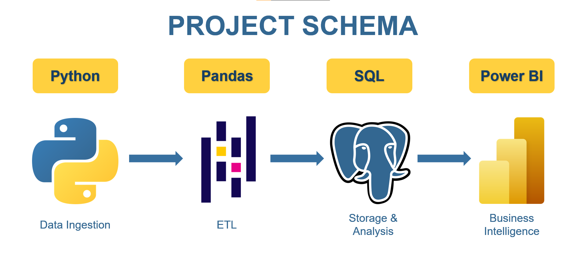

# 🎵 End-to-End Music Data Pipeline & Analysis (API → SQL → Power BI)

readme do ukończenia

## 🔎 Introduction

This project is divided into four separate steps

- **Step 1:** Downloading music data from [last.fm](https://www.last.fm/) site using API and Python script - [api_request.py](python_files/api_request.py).

- **Step 2:** Load data from the script ab to Pandas dataframe (Python library). [This](python_files/data_overview_&_load_to_sql_db.ipynb) file includes data overview and cleaning too. Then the file connects to PostgreSQL server and it loads dataframe to the database. 

- **Step 3:** Data analysis using SQL database loaded in the previous step.

- **Step 4:** Visualize data using Power BI.

**Note:** I used the import feature (from a PostgreSQL server) to load data into Power BI in order to practice my Power BI skills (especially Power Query), although a faster approach would be to save the SQL results as CSV files and then import them instead.

## ⚙️ How to Run

1. Install PostgreSQL and Python locally. Create music_db database in PostgreSQL.
2. Download the entire folder.
3. Follow the instructions in [data_overview_&_load_to_sql_db.ipbyn](python_files/data_overview_&_load_to_sql_db.ipynb) file and run all cells using Jupyter Notebook or Visual Studio Code.
4. Now you can run SQL files ([artists_analysis.sql](sql_files/artists_analysis.sql) and [songs_analysis.sql](sql_files/songs_analysis.sql)).

## 📊 Visualization

This dashboard shows information in detail for: the most popular artists & songs, number of songs by its duration, the most common words used in title, etc. You can filter the data by a chosen artist or a song in the left top corner.

You can download the dashboard [here](Dashboard.pbix)

## 💡 Key Insights

-

## 💪 Skills Used

### 👨‍💻 Python

0 na null w pandas

- Importing modules
- Defining functions
- 

### 🛢️ SQL

- Keys and indexes setup
- String functions (SUBSTRING)
- Window functions
- Common Table Expressions (CTEs)
- Joins
- Defining a new funciton
- UNNEST() function (expending an array into a set of rows)
- REGEXP_REPLACE() function (...) 
- Aggregation
- CASE Expression

### 📊 Power BI
   
- Power Query:
    - Filtering
    - Data type normalization
    - Value replacement
    - Dodawanie kolumny warunkowej i niestandardowej
- Charts 
- Cards 
- Slicers
- Editing Interactions

## 🖥️ Technical Details

- **DBMS:** PostgreSQL
- **Environment:** Visual Studio Code
- **Data source:** [last.fm](https://www.last.fm/) 
    - API link: http://ws.audioscrobbler.com/2.0/
    - API documentation: https://www.last.fm/api/scrobbling 
- **Visualization:** Power BI

## ✒️ Author

- **Author:** Mateusz Bochenek
- **Mail:** matbochenek42@gmail.com
- **GitHub link:** https://github.com/matbochenek42
- **LeetCode link:** https://leetcode.com/u/SmO7BWmsiz/
